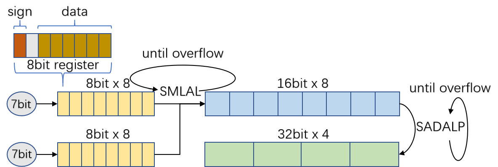

# EasyQuant: Post-training Quantization via Scale Optimization

EasyQuant(EQ) is an efficient and simple post-training quantization method via effectively optimizing the scales of weights and activations. Our paper is available on [arXiv](https://arxiv.org/pdf/2006.16669.pdf)

## Requirements

[eq-ncnn](https://github.com/deepglint/eq-ncnn)

[caffe](https://github.com/BVLC/caffe)

```
pip install -r requirements.txt
```

## Updates:
* 06/25/2020: We have released EasyQuant.pdf paper and eq-ncnn.
* 06/24/2020: We have released VGG16 example.

## Data Preparation
First, for ImageNet1k classification task, please download [ImageNet2012](http://image-net.org/download). We random sampled 3000 calibration images from ImageNet val set to `data/calib.txt` for KLD quantization and select 50 samples from calib to `data/list50.txt` for EasyQuant scale finetuning. Then we will evaluate quantified models on val set.

## How to Run

1. Get caffe and ncnn ready
2. Build python\_ncnn 
```
# 
cd python_ncnn
# modify ncnn build path in Makefile
make -j8
```

3. Run VGG16 example

```
cd ..
sh example/vgg16/run.sh
```

This following 6 steps will be performed in run.sh.
```
# download vgg16 model and upgrade proto and caffemodel files
sh model/vgg16/net_file_upgrade.sh

# generate scale of weight and activation use quantation tools
sh example/vgg16/run_scale_quantation.sh

# get ncnn param bin from scale table
sh example/vgg16/run_caffe2ncnn.sh

# infer layer blob shape
sh example/vgg16/run_infer_shape.sh

# run scale fine tuning
sh example/vgg16/run_scale_fine_tuning.sh

# run validtion on imagenet val
sh example/vgg16/run_validation.sh
```

## Results

### Validation Results
#### 1. Classification on ImageNet2012 validation dataset for different convolutional models in context of both INT8 and INT7 post-training quantization.
| Models | FP32 | INT8-TRT | INT8-EQ | INT7-TRT | INT7-EQ |
| :----: | :--: | :------: | :-----: | :------: | :-----: |
| SqueezeNetV1.1 | 56.56 | 56.24 | **56.28** | 54.88 | **56.08** |
| MobileNetV1 | 69.33 | 68.74 | **68.84** | 66.97 | **68.26** |
| VGG16 | 70.97 | 70.95 | **70.97** | 70.92 | **70.96** |
| ResNet50 | 75.20 | 75.04 | **75.13** | 72.78 | **75.04** |

#### 2. Object detection on VOC2007 task for SSD models with bachbone SqueezeNet and MobileNet V1.

| Models | FP32 | INT8-TRT | INT8-EQ | INT7-TRT | INT7-EQ |
| :----: | :--: | :------: | :-----: | :------: | :-----: |
| SqueezeNet-SSD | 62.00 | 61.45 | **62.05** | 60.01 | **61.62** |
| MobileNet-SSD | 72.04 | 69.79 | **71.39** | 63.88 | **68.79** |

#### 3. Verification performance for InsightFace model MobileFaceNet on 7 most common validation dataset
| Models | FP32 | INT8-TRT | INT8-EQ | INT7-TRT | INT7-EQ |
| :----: | :--: | :------: | :-----: | :------: | :-----: |
| lfw | 99.45  | 99.36 | **99.48** | 99.28 | **99.36** |
| agedb\_30 | 95.78  | 95.23 | **95.38** | 95.03 | **95.73** |
| calfw | 95.05  | 94.76 | **94.88** | **94.75** | 94.68 |
| cfp\_ff | 99.50  | 99.50 | **99.61** | 99.44 | **99.60** |
| cfp\_fp | 89.77  | 89.17 | **90.04** | 88.47 | **89.87** |
| cplfw | 86.45  | 85.58 | **86.03** | 85.91 | **86.76** |
| vgg2\_fp | 90.64  | 89.70 | **90.50** | 89.64 | **90.44** |

#### 4. Compare our method with more complex QAT(quantization aware trainin) approach in 8 bit width.
| Methods | MobileNetV1-FP32 | MobileNetV1-INT8 | ResNet50-FP32 | ResNet50-INT8 |
| :-----: | :--------------: | :--------------: | :-----------: | :-----------: |
| EQ | 69.33  | 68.84 | 75.20 | **75.13** |
| QAT | 70.90  | **70.70** | 75.20 | 75.00 |

### Speed Tests

INT7 Post-training Inference VS INT8 on real devices.
We implement our efficient designs on INT7 post-training inference which well be released in [eq-ncnn](https://github.com/deepglint/eq-ncnn)


#### 1. The latency (ms) performance on RK3399, whose inside is a 1.5 GHz 64-bit Quad-core ARM Cortex-A53. \#k means k threads.

| Models | TRT-INT8(\#1) | EQ-INT7(\#1) | TRT-INT8(\#4) | EQ-INT7(\#4) |
| :----: | :-----------: | :----------: | :-----------: | :----------: |
| SqueezeNetV1.1 | 180 | **120** | 66 | **44** |
| MobileNetV1 | 234 | **189** | 65 | **57** |
| VGG16 | 3326 | **2873** | 1423 | **1252** |
| ResNet50 | 1264 | **993** | 415 | **300** |

#### 2. The latency (ms) performance on RK3399, which inside is a 1.8 GHz 64-bit Dual-core ARM Cortex-A72. \#k means k threads.
| Models | TRT-INT8(\#1) | EQ-INT7(\#1) | TRT-INT8(\#2) | EQ-INT7(\#2) |
| :----: | :-----------: | :----------: | :-----------: | :----------: |
| SqueezeNetV1.1 | 79 | **57** | 54 | **37** |
| MobileNetV1 | 105 | **84** | 56 | **46** |
| VGG16 | 1659 | **1385** | 1034 | **849** |
| ResNet50 | 559 | **463** | 338 | **262** |
## Contributing

PRs accepted.

## License and Citation

BSD3 © DeepGlint
```
@inproceedings{easyquant,
    title={EasyQuant: Post-training Quantization via Scale Optimization},
    author={Di Wu, Qi Tang, Yongle Zhao, Ming Zhang, Debing Zhang, Ying Fu},
    year={2020}
}
```
